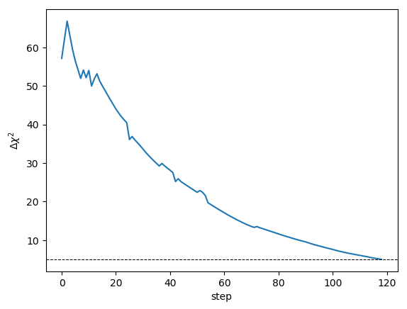
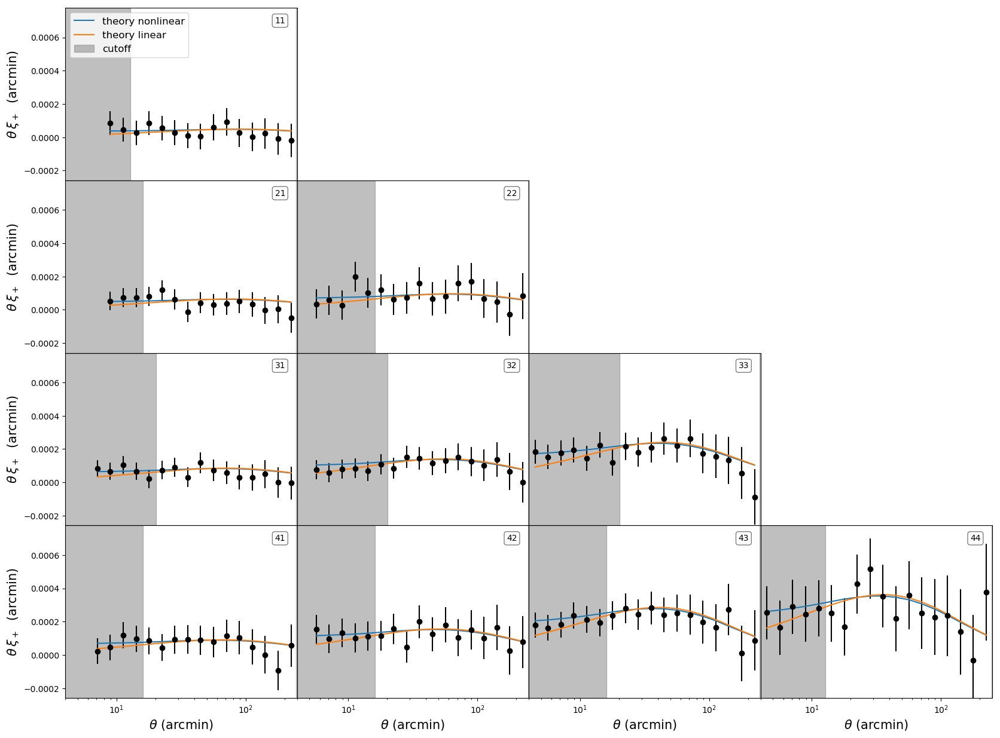
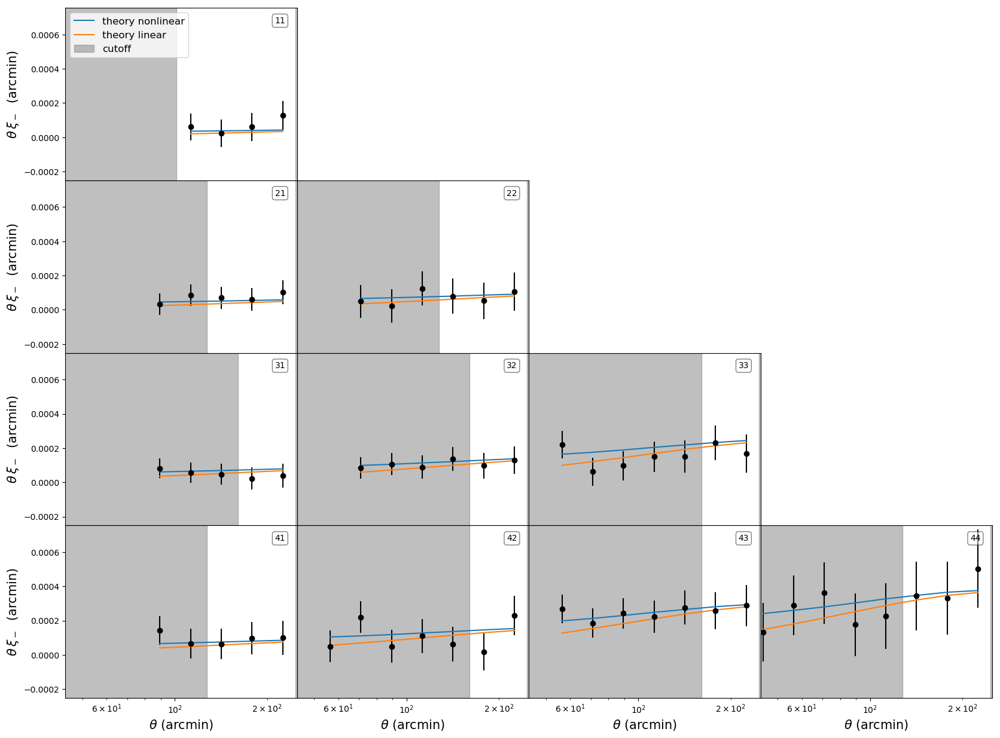
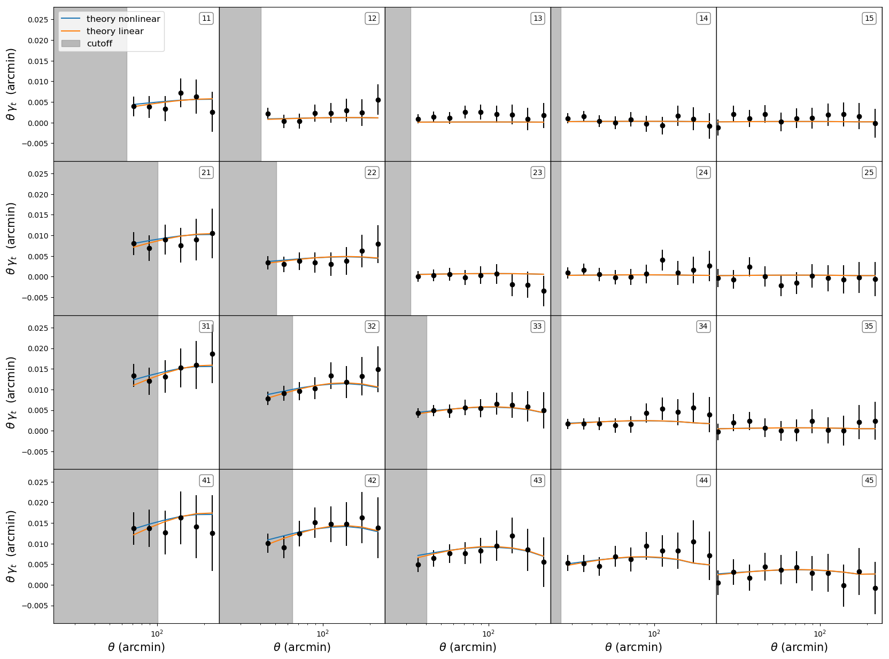
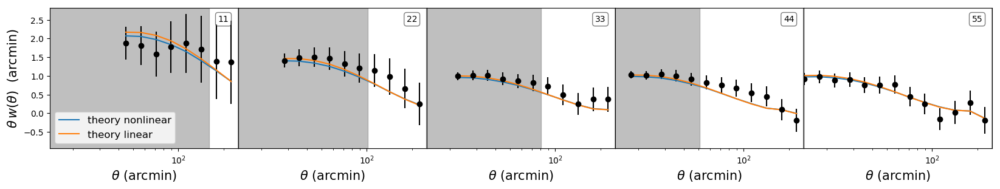

DES 1YR linear data cutoff for CosmoMC
==================================

The code in this repo is used to produce the linear data cutoffs for the Dark Energy Surver (DES) used in [CosmoMC](https://github.com/cmbant/CosmoMC).

This code is used in [MGCosmoMC](https://github.com/sfu-cosmo/MGCosmoMC). 

The galaxy clustering and weak lensing two point correlations functions provided by the Dark Energy Survey (DES) probe non-linear angular scales. When 

## 1. Installing:
To install this code on your machine, type the following commands on the terminal
```bash
git clone https://github.com/alexzucca90/DES_linear_data
```

## 2. Running the code:
To run this code, type the following commands on your terminal
```bash
cd DES_linear_data
python DES_linear_cutoff.py -t threshold -c name_of_cutoff
```
where ```threshold``` is a fload that defines the threshold to remove the data and ```name_cutoff``` is a string that names the cutoff.

## 3. Outputs:
The code produces a file ```./output/DES_1YR_final_name_of_cutoff_cut.dat``` that contains the used bins and the angular separation range for the correltaion function.

It also outputs a set of plots (in png and pdf formats) that can be used for visual inspection of the data cuts.


## 4. Examples:

### Standard cutoff
To generate the *standard* DES linear data cut (see our paper), run
```bash
python DES_linear_cutoff.py -t 5.0 -c standard
```
The code starts elimintaning the point that contributes the most to the Delta Chi^2, then recomputes the Delta Chi^2 and repeats the procedure. The improvement in the Delta Chi^2 is shown in the following plot
<p align="center">

</p>

and eliminates the data points in the shaded regions below

<p align="center">


</p>
<p align="center">


</p>

## 5. References:
Papers illustrating the method to remove the non-linear data:

*  *Dark Energy Survey Year 1 Results: Constraints on Extended Cosmological Models from Galaxy Clustering and Weak Lensing*  
    DES Collaboration 
    [arXiv:1810.02499 [astro-ph.CO]](https://arxiv.org/abs/1810.02499)
    
*   *Planck 2015 results. XIV. Dark energy and modified gravity*  
    Planck Collaboration   
    [arXiv:1502.01590 [astro-ph.CO]](https://arxiv.org/abs/1502.01590)
    


